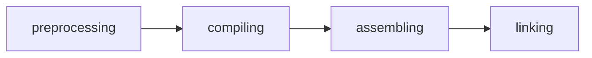
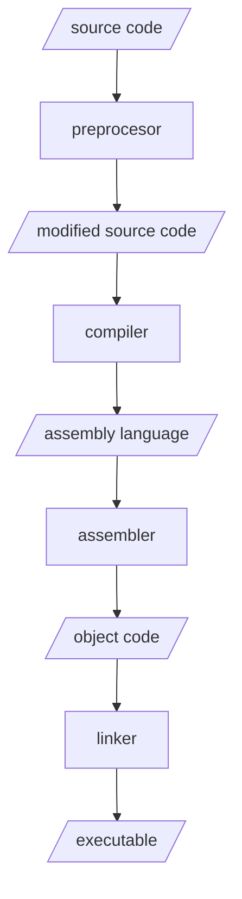

# Section 01

## The C Compilation Processes

## The C Compilation Processes and IOs

## Registers

Registers are ultra high speed storage locations built into the circuitry of the
processor.

On the ARM, all computation takes place in the registers (with very few exceptions).

## Stack

The stack is a region of memory used to store local variables as well as the trail of
breadcrumbs which allows functions to return from whence they were invoked. In a high
level language, you don't manage the stack yourself. Stacks just happen.

In a higher level language, values go onto the stack (push) and leave the stack (pop)
passively by virtue of having made function calls and declaring local variables.
In assembly language you manage the stack!
