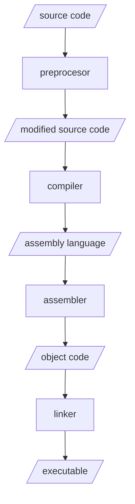

# Section 01

## The C Compilation Processes

```mermaid
flowchart LR
  preprocessing --> compiling --> assembling --> linking
```

## The C Compilation Processes and IOs

```mermaid
flowchart TD
  a[/source code/] -->
  b[preprocesor] -->
  c[/modified source code/] -->
  d[compiler] -->
  e[/assembly language/] -->
  f[assembler] -->
  g[/object code/] -->
  h[linker] -->
  i[/executable/]
```
